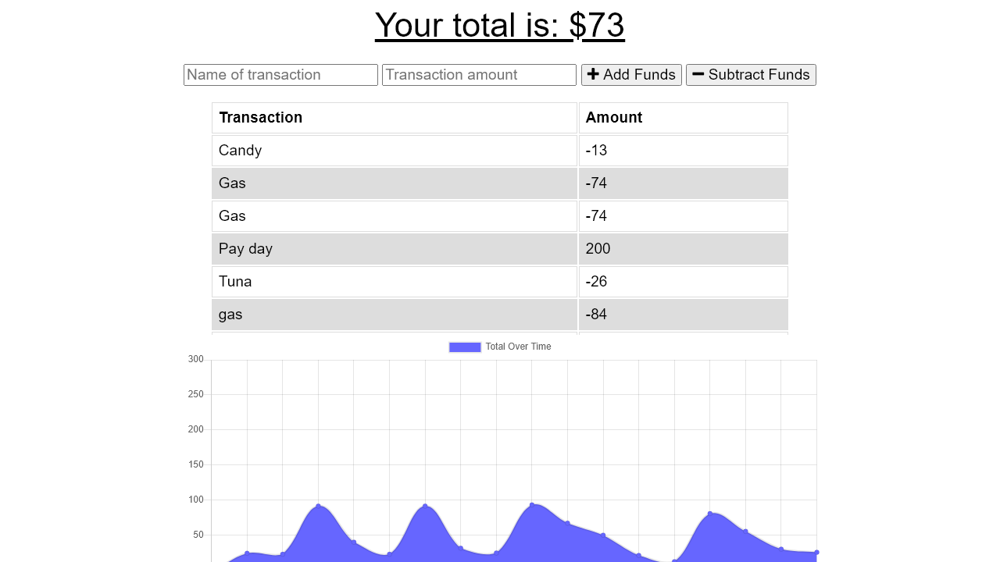

# Budget Tracker (Service Worker)

A budget tracker app that uses indexDB and Service Worker to support offline functionality

## Table of Contents

1. [Installation](#installation)
1. [Usage](#usage)
   1. [Screenshots](#screenshots)
1. [License](#license)
1. [Contributing](#contributing)
1. [Tests](#tests)
1. [Questions](#questions)

## Installation

npm i

## Usage

To use this project, first create a .env file and enter your mongoDB details. Then use npm run to launch the app. This app can be installed as it is a PWA.

### Screenshots

[Live Deployed Link](https://budget-tracker-serviceworker.herokuapp.com/)

### Mobile

### Browser

## License

[MIT License](https://mit-license.org/)

## Contributing

n/a

## Tests

n/a

## Questions

[Find me on Github](https://github.com/tbellenger)

Or you can contact me at tbellenger@gmail.com if you have any questions
